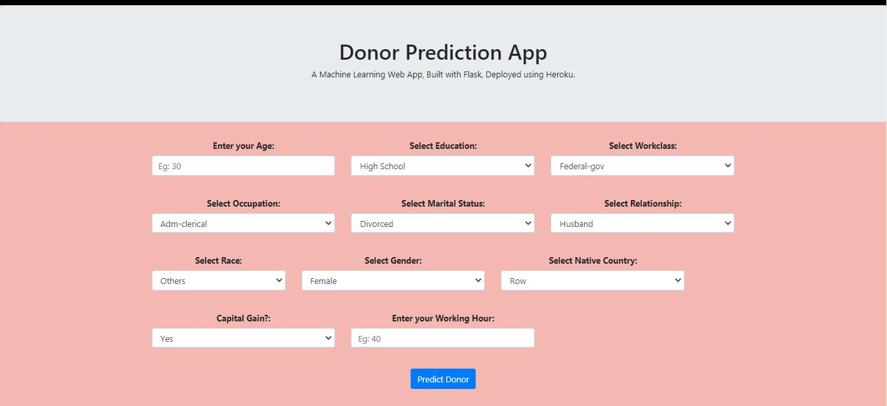

# Donors-for-Charity-Prediction

 

## Project Objectives :
The objective of the project is to create a machine learning model. We are doing a supervised learning and our aim is to do predict whehter a person will donate to the charity or not. This type of problem can be looked to as Customer Targeting.

## Data Collection :
The dataset is obtained from Kaggle. 

Link: https://www.kaggle.com/uciml/adult-census-income

## Modelling :
The analysis and model creation can be found in the .ipynb file. 

The main packages used are numpy, pandas, matplotlib, seaborn and sklearn.  

## Deployemnt :
The web app has been build using basic HTML, CSS, Javascript, Flask and Herkou.

Due to large size of pickle file, the app was not deployed to a server, but it can be used on the local server.

## Future Scope :
* Use multiple Algorithms
* Optimize Flask app.py
* Update the Front-End 
